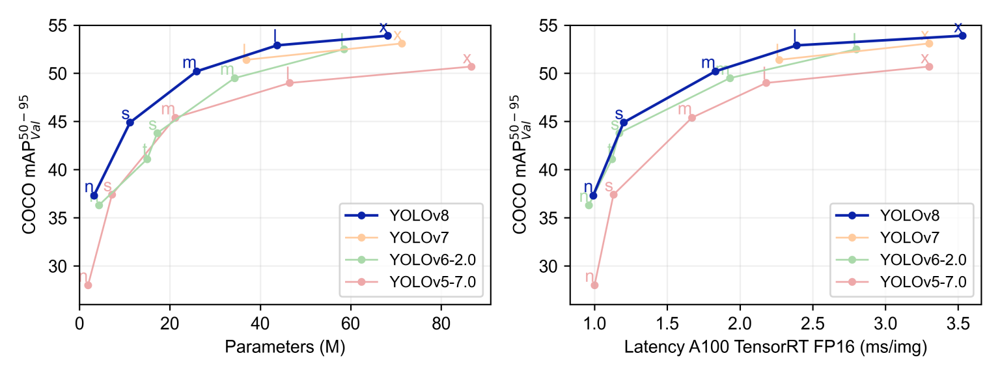
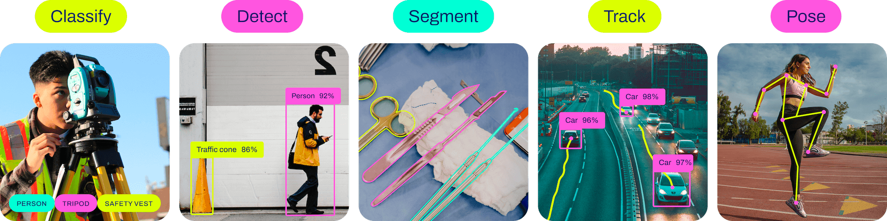

<h1 align="center">
  <a href="https://github.com/aimebertrand/documentation-stage-juillet-aout-2021">
    <!-- Please provide path to your logo here -->
    
  </a>
</h1>

<div align="center">
<br />
</div>

# Documentation Projet Computer Vision
Ce ReadMe contient la documentation du projet Computer Vision réalisé dans le cadre du Master 2 IA de la MIAGE de l'Université cote d'azur.

## Étudiants
 
* **Baili Yannis** 
* **Bertrand Aimé**

<details open="open">
<summary>Sommaire</summary>

- [Documentation](#Documentation)
  - [Introduction](#Introduction)
  - [Installation](#Installation)
  - [Utilisation](#Utilisation)
  - [Modeles](#Modeles)
  - [Entrainement](#Entrainement)
  - [Format du Dataset](#Format-du-Dataset)
</details>

### Introduction

Pour des informations détaillées sur l'entraînement, la validation, la prédiction et le déploiement, voir les [Docs YOLOv8](https://docs.ultralytics.com).

YOLO, acronyme de 'You only look once', est un ensemble d'algorithme de détection d'objets, de ségmentation d'instance et de classification qui est connu pour sa rapidité et sa précision. [Yolo expliqué](https://blog.roboflow.com/a-thorough-breakdown-of-yolov4/) 

YOLOv8 est le modèle YOLO le plus récent et le plus avancé. Il est plus rapide et plus précis que le modèle influent YOLOv5. Il est également plus facile à entraîner et à déployer ainsi que plus performant. 

### Installation


Installez le package `ultralytics` avec pip. Celui va installer toutes les [dépendances](https://github.com/ultralytics/ultralytics/blob/main/requirements.txt) dans un environnement [**Python>=3.8**](https://www.python.org/) avec [**PyTorch>=1.8**](https://pytorch.org/get-started/locally/).

```bash
pip install ultralytics
```

### Utilisation

- En ligne de commande
Utilisez YOLOv8 directement en CLI avec la commande yolo :

```bash
yolo predict model=yolov8n.pt source='0'
```
```bash
yolo predict model=yolov8n.pt source='https://ultralytics.com/images/bus.jpg'
```
```bash
yolo predict model=yolov8n.pt source='https://www.youtube.com/watch?v=jjlBnrzSGjc'
```

- En Python
YOLOv8 peut également être utilisé dans un environnement Python :
    
```python
from ultralytics import YOLO

# Charger un modèle
model = YOLO("yolov8n.pt")  # charger un modèle pré-entraîné

# Utiliser le modèle
results = model("https://ultralytics.com/images/bus.jpg")  # prédire sur une image
results.show()  # afficher les prédictions sur l'image
```
### Modeles

YOLOv8 propose des modèles pré-entraînés pour la détection, la segmentation et la pose sur le dataset COCO, ainsi que des modèles de classification pré-entraînés sur le dataset ImageNet. Le mode Track est disponible pour tous les modèles de détection, de segmentation et de pose.



Tous les modèles se téléchargent automatiquement lors de la première utilisation.

### Entrainement

Voyons comment entraîner un modèle YOLOv8 pour la classification d'images.

- En Python

```python
from ultralytics import YOLO

# Charger un modèle
model = YOLO('yolov8n-cls.yaml')  # Construire un nouveau modèle à partir de YAML
model = YOLO('yolov8n-cls.pt')    # Charger un modèle pré-entraîné (recommandé pour l'entraînement)
model = YOLO('yolov8n-cls.yaml').load('yolov8n-cls.pt')  # Construire à partir de YAML et transférer les poids

# Entraîner le modèle
results = model.train(data='mnist160', epochs=100, imgsz=64)
```

- En ligne de commande

```bash
# Construire un nouveau modèle à partir de YAML et commencer l'entraînement à partir de zéro
yolo classify train data=mnist160 model=yolov8n-cls.yaml epochs=100 imgsz=64

# Commencer l'entraînement à partir d'un modèle *.pt pré-entraîné
yolo classify train data=mnist160 model=yolov8n-cls.pt epochs=100 imgsz=64

# Construire un nouveau modèle à partir de YAML, transférer les poids pré-entraînés et commencer l'entraînement
yolo classify train data=mnist160 model=yolov8n-cls.yaml pretrained=yolov8n-cls.pt epochs=100 imgsz=64
```

### Format du Dataset

Pour la classification, les datasets suivent généralement cette structure :

```bash
root/
|-- class1/
|   |-- img1.jpg
|   |-- img2.jpg
|   |-- ...
|
|-- class2/
|   |-- img1.jpg
|   |-- img2.jpg
|   |-- ...
|
|-- class3/
|   |-- img1.jpg
|   |-- img2.jpg
|   |-- ...
|
|-- ...
```

